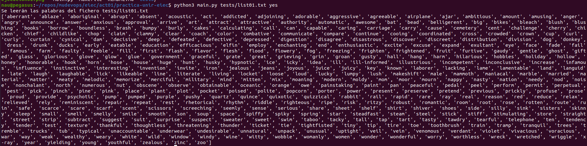

# Repo para EIEC - DevOps - UNIR

Este repositorio nos servirá para demostrar el uso de Git en la asignatura de EIEC y muchas cosas mas.

---

Los comandos del Makefile funcionarán en Linux y MacOS. En caso de usar Windows, necesitarás adaptarlos o ejecutarlos en una máquina virtual Linux.

## Ejecución

python3 main.py <filename> <dup>
  filename: **ruta** al fichero que contiene la lista de palabras, una por línea
  dup: **yes|no**, yes para eliminar palabras duplicadas, no para mantener la lista

## Ejecución de ejemplo
1. Se ha creado el directorio tests para albergar ficheros con listas de palabras que puedan ser usados como inputs
de la solución para pruebas
2. Se ha creado el fichero test01.txt con 500 palabras aleatorias 
3. Se ejecuta la aplicación mediante

3.a. python3 main.py tests/list01.txt no
Es decir, se ordena el fichero list01.txt presente en tests sin eliminar las  palabras duplicadas:

3.b python3 main.py tests/list01.txt yes
Es decir, se ordena el fichero list01.txt presente en tests eliminando las palabras duplicadas:

